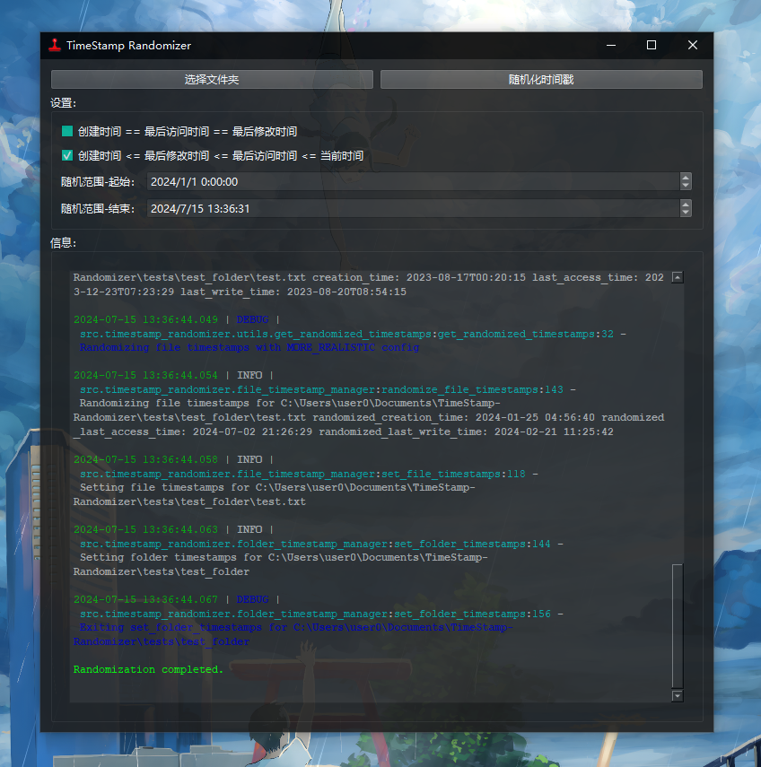

# TimeStamp-Randomizer

# ❗ gui未完成，正在施工 🚧

---

遍历文件夹，随机化文件和文件夹的时间戳（创建时间、修改时间、访问时间）。

## 功能

- 会记录原始的时间戳，保存在 sqlite3 数据库中
- 可选设置 创建时间==修改时间==访问时间（默认禁用）
- 可选设置 创建时间<=修改时间<=访问时间<=当前时间（默认启用，更逼真）
- 可选设置 随机化范围（默认 当前年份）
